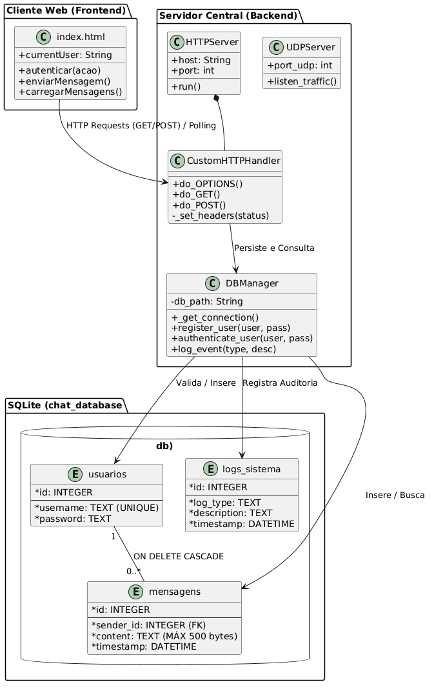

# cic-socketstudy

Projeto prático desenvolvido para a disciplina **CIC0124 - Redes de Computadores** na Universidade de Brasília (UnB).

## Integrantes
* **Nicolas Coqueiro Almeida de Freitas** 
* **Maria Luiza Teixeira da Silva**
* **Professora:** Profa. Priscila Solis 

---

## Sobre o Projeto
O projeto consiste em um **Sistema de Chat Híbrido Multiusuário** baseado na arquitetura Web, implementando os conceitos fundamentais das camadas de Aplicação e Transporte. A plataforma integra requisições tradicionais sobre o protocolo HTTP com disparos rápidos via sockets não-orientados à conexão (UDP), permitindo a análise comparativa de desempenho exigida no escopo acadêmico.

### Tecnologias Utilizadas
* **Servidor Central (Backend):** Python 3 (`http.server` nativo, Sockets e Threading)
* **Banco de Dados:** SQLite (Controle de unicidade, chaves estrangeiras com cascateamento e logs históricos)
* **Interface do Usuário (Frontend):** Cliente Web Nativo (HTML5, CSS3 e JavaScript assíncrono com Polling)
* **Análise de Protocolos:** Wireshark (Captura de pacotes, metrificação de RTT, Throughput e overhead de cabeçalhos)

---

## Objetivos Alcançados (Especificação da Disciplina)
1. **Protocolo HTTP Nativo:** Processamento de requisições `GET`, `POST` e pre-flight `OPTIONS` (CORS), sem dependência de frameworks externos.
2. **Defesa de Integridade de Dados:** Validação estrita de pacotes no backend com limitação rígida de carga útil para mensagens (máximo de 500 caracteres/bytes).
3. **Persistência Relacional Segura:** Banco de dados estruturado com tratamento nativo de chaves estrangeiras ativas (`PRAGMA foreign_keys = ON`) e restrição de unicidade (`UNIQUE`) para credenciais.
4. **Cenário Comparativo (TCP x UDP):** Fluxo de mensagens estruturado via requisições HTTP (sobre TCP) concorrentes operando em paralelo a um motor UDP isolado projetado para testes de estresse e perda de datagramas.

---

##Como Executar o Projeto

# Como Executar o Projeto

Este documento descreve o processo completo de execução do sistema, incluindo inicialização do servidor, abertura da interface web, simulação de tráfego UDP e execução dos testes automatizados.

---

# 1. Iniciar o Servidor Central

O backend unificado do projeto é responsável pelos serviços HTTP e UDP da aplicação.

## Serviços Disponíveis

| Serviço | Porta |
|---|---|
| HTTP | 5000 |
| UDP | 5001 |

## Execução

No terminal raiz do projeto, execute:

```bash
python3 -m servidor.main
```

Após a execução, o servidor ficará responsável por:

- Receber requisições HTTP do cliente web
- Gerenciar mensagens do chat
- Processar eventos UDP
- Controlar status de digitação em tempo real

---

# 2. Abrir o Cliente Web

A interface do sistema é executada diretamente no navegador.

## Passos

1. Navegue até a pasta:

```text
cliente_desktop/
```

2. Abra o arquivo:

```text
index.html
```

em qualquer navegador moderno.

## Navegadores Compatíveis

- Google Chrome
- Mozilla Firefox
- Microsoft Edge

---

# 3. Simular Conversas Entre Usuários

Para validar o funcionamento do chat em múltiplas sessões:

- Abra duas abas diferentes
- Ou utilize uma janela anônima/incógnita

## Exemplo de Usuários

```text
nicolas
nicolas1
```

Isso permite simular troca de mensagens entre dois clientes conectados simultaneamente.

---

# 4. Simular Tráfego UDP ("Digitando...")

O sistema possui suporte a eventos UDP para atualização de status em tempo real.

O script de testes envia datagramas UDP ao servidor para simular o evento:

```text
digitando...
```

## Execução

Com o servidor já ativo e o navegador aberto, execute em outro terminal:

```bash
python3 tests/test_udp_traffic.py
```

## Objetivo do Teste

Validar:

- Comunicação UDP
- Atualização em tempo real
- Eventos de digitação
- Recebimento de datagramas
- Integração entre backend e frontend

---

# 5. Executar os Testes Automatizados

Os testes automatizados validam regras críticas do sistema.

---

## 5.1 Teste da Base de Dados

Valida:

- Restrições da base
- Integridade dos dados
- Operações CRUD
- Persistência

### Execução

```bash
python3 -W ignore -m unittest tests/test_database.py
```

---

## 5.2 Teste de Segurança do Payload HTTP

Valida:

- Limite máximo de payload
- Segurança das requisições HTTP
- Restrição de tamanho de mensagens

## Limite Validado

```text
500 bytes
```

### Execução

```bash
python3 -W ignore -m unittest tests/test_http_payload.py
```

---

# Fluxo Completo de Execução

## Ordem Recomendada

### 1. Iniciar o backend

```bash
python3 -m servidor.main
```

### 2. Abrir o cliente web

```text
cliente_desktop/index.html
```

### 3. Simular eventos UDP

```bash
python3 tests/test_udp_traffic.py
```

### 4. Executar testes automatizados

```bash
python3 -W ignore -m unittest tests/test_database.py

python3 -W ignore -m unittest tests/test_http_payload.py
```

---
## Modelagem Arquitetural (UML)

### Visão Geral do Fluxo (Diagrama de Classes)

O fluxo detalha a comunicação híbrida empregada no projeto: transações estruturadas de cadastro, login e mensagens utilizam canais síncronos HTTP/TCP, enquanto fluxos independentes operam via UDP para fins de amostragem de tráfego.



---

## Arquitetura do Projeto

```text
├── .gitignore
├── README.md                    # Descrição, integrantes e especificações do projeto
├── docs/                        # Documentação técnica e relatórios do projeto
│   ├── relatorio_wireshark.pdf  # Análises de atraso, vazão e capturas de tráfego
│   ├── protocolo_aplicacao.md   # Especificação dos métodos HTTP e JSONs aceitos
│   └── src/                     # Recursos visuais e enunciados
│       ├── projeto1-20261.pdf   # Especificação original do projeto
│       └── uml_classes.png      # Imagem do Diagrama de Classes do sistema
├── servidor/                    # Código-fonte do servidor central
│   ├── main.py                  # Inicializador unificado do backend (HTTP e UDP)
│   ├── core/                    # Motores e protocolos de rede
│   │   ├── __init__.py
│   │   ├── http_server.py       # Servidor HTTP nativo (GET/POST) com limite de 500 bytes
│   │   └── udp_server.py        # Servidor UDP para capturar status de digitação em tempo real
│   ├── database/                # Camada de persistência relacional
│   │   ├── __init__.py
│   │   ├── chat_database.db     # Banco SQLite local (ignorado no versionamento)
│   │   └── db_manager.py        # Gerenciador de queries, constraints e logs
│   └── logs/                    # Histórico de execução do sistema
│       └── server.log           # Arquivo físico de logs de auditoria
├── cliente_desktop/             # Interface gráfica do utilizador (Frontend)
│   ├── index.html               # Estrutura HTML do chat e autenticação
│   ├── style.css                # Estilização visual e responsividade da interface
│   └── app.js                   # Lógica de controle do cliente, polling HTTP e gatilho UDP
└── tests/                       # Suite de testes automatizados e simulação
    ├── test_database.py         # Validação de constraints, integridade e logs do SQLite
    ├── test_http_payload.py     # Validação estrita do limite de 500 bytes no corpo HTTP
    └── test_udp_traffic.py      # Simulador de injeção de tráfego UDP para o "Digitando..."


