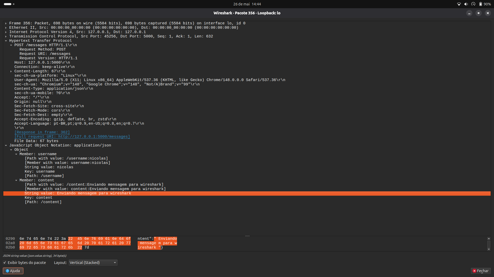
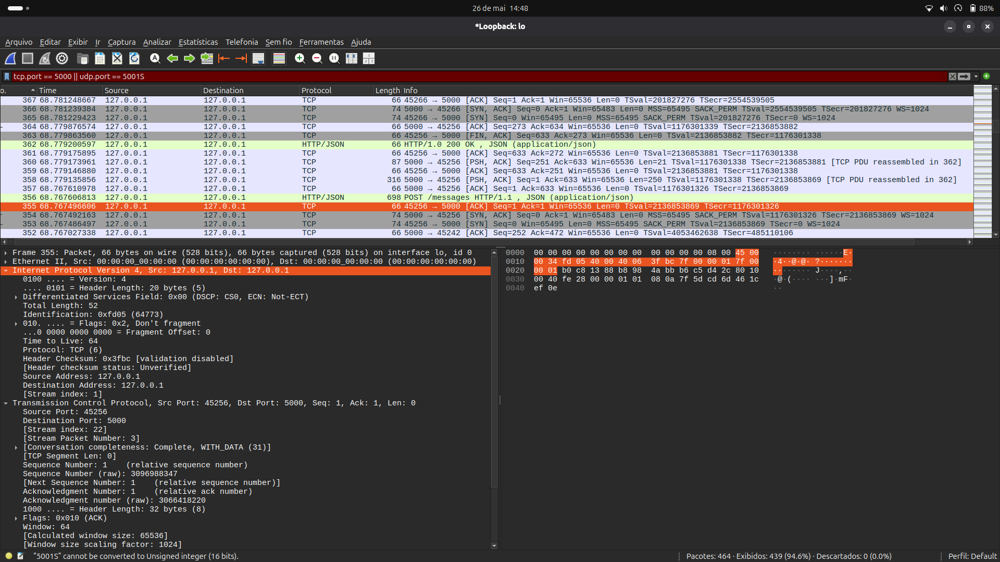
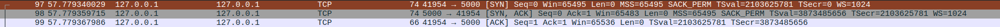
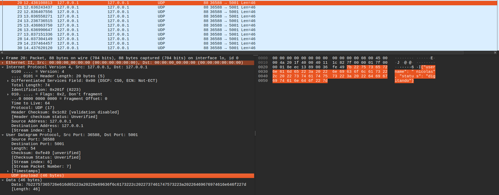
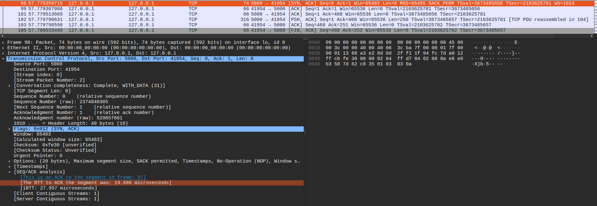
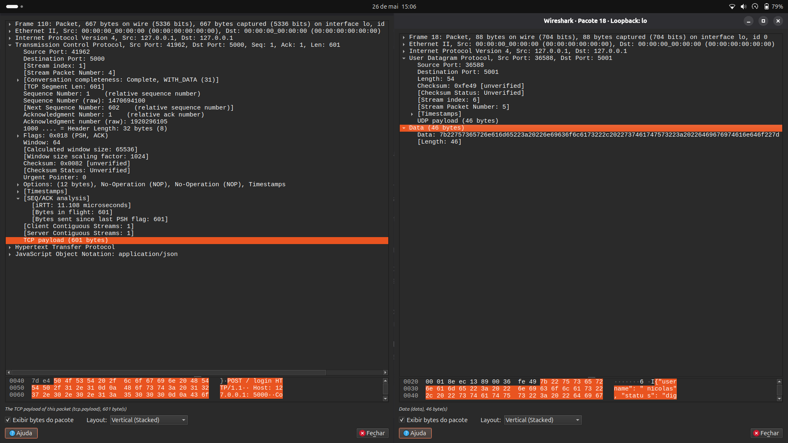
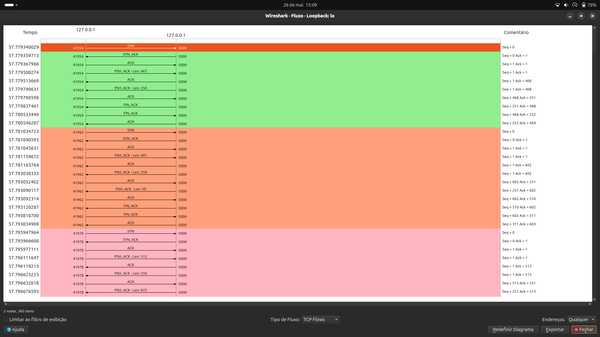
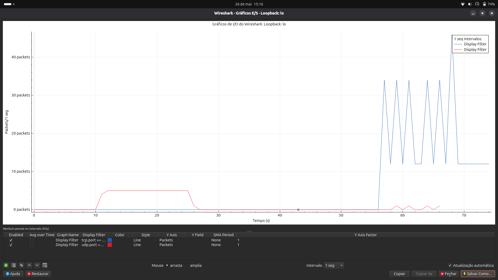

# Relatório de Análise Prática de Tráfego
**Disciplina:** Redes de Computadores 
**Contexto Acadêmico:** Ciência da computação – Universidade de Brasília (UnB) 

---

## 1. Introdução Teórica e Arquitetural

Este documento apresenta a análise empírica do comportamento do ecossistema de comunicação, desenvolvido sob o modelo cliente-servidor para viabilizar interações em tempo real (chat textográfico e monitoramento de estado do teclado). A validação técnica foi executada através da captura e análise de pacotes via *software* **Wireshark**, correlacionando os dados experimentais coletados na interface de *Loopback* (`127.0.0.1`) com as diretrizes fundamentais de redes de computadores abordadas nos Capítulos 1 e 2 do livro-texto *Redes de Computadores e a Internet* (Kurose & Ross).

O ecossistema implementa uma arquitetura híbrida na camada de transporte para fins de otimização de desempenho e atendimento aos requisitos de projeto:
* **Fluxo de Controle e Persistência (HTTP sobre TCP - Porta 5000):** Utilizado em operações que exigem entrega confiável, controle de erros e ordenação estrita de mensagens (autenticação, registro e histórico de chat).
* **Fluxo Volátil de Alta Frequência (UDP nativo - Porta 5001):** Utilizado no mecanismo de sinalização de digitação em tempo real ("*Digitando...*"), priorizando o menor overhead estrutural e latência mínima em detrimento da garantia de entrega.

---

## 2. Análise dos Itens Mínimos Obrigatórios (Wireshark)

### Item 1: Identificação do Protocolo de Aplicação Desenvolvido
O protocolo de aplicação opera no modelo estrito Cliente-Servidor. As requisições e respostas seguem o padrão semântico HTTP/1.1 estruturadas em payloads textuais no formato **JSON (JavaScript Object Notation)**. 

Ao inspecionar o pacote de envio de mensagens (`POST /messages`), observa-se o encapsulamento do JSON em texto puro contendo as chaves `username` e `content`. A legibilidade sintática e o uso de delimitadores explícitos são características do nível de aplicação para permitir que o parser do servidor identifique e processe os dados de forma unívoca.

### Item 2: Identificação dos Protocolos das Camadas de Transporte e Rede
A captura evidencia de forma prática o conceito de **encapsulamento** de dados na pilha de protocolos da Internet (TCP/IP). A árvore de detalhes do Wireshark expõe as camadas empilhadas:
1.  **Camada de Rede (Network Layer):** Operada pelo protocolo **IPv4**, onde os endereços de origem e destino estão fixados em `127.0.0.1` (interface local).
2.  **Camada de Transporte (Transport Layer):** Demonstra o processo de **multiplexação** através de portas de software. O tráfego do chat converge para a porta destino **5000 (TCP)**, enquanto o monitoramento de digitação é direcionado para a porta destino **5001 (UDP)**.

### Item 3: Análise do Handshake TCP
Por se tratar de comunicação sobre HTTP, o estabelecimento de uma conexão confiável fim a fim exige o mecanismo clássico de **Aperto de Mão de Três Vias (Three-Way Handshake)** antes da transmissão de dados. A captura cronológica isolou com precisão a sequência de controle:
1.  **Segmento `[SYN]`:** O navegador (cliente) envia um sinalizador contendo um número de sequência inicial aleatório para a porta 5000.
2.  **Segmento `[SYN, ACK]`:** O servidor Python responde confirmando o recebimento (`Ack=1`) e transmitindo seu próprio número de sequência inicial.
3.  **Segmento `[ACK]`:** O cliente finaliza o acordo, abrindo formalmente o circuito lógico para tráfego seguro de dados.

### Item 4: Análise de Pacotes UDP
Para a notificação dinâmica de digitação, utilizou-se o protocolo **UDP** visando eliminar a sobrecarga (*overhead*) de handshakes ou buffers de retransmissão. Na árvore do Wireshark, constata-se a simplicidade estrutural do cabeçalho UDP. Ele dispensa campos complexos de controle presentes no TCP, exibindo apenas as portas (origem/destino), a soma de verificação (*Checksum*) e o comprimento total. 

Na arquitetura da Internet, o cabeçalho UDP possui tamanho fixo de **8 bytes**. O campo **`Length`** exposto reflete o somatório desses 8 bytes fixos com o tamanho da string JSON transmitida. Caso ocorressem congestionamentos ou descartes, o protocolo não atuaria na retransmissão, o que é plenamente tolerável para atualizações efêmeras de estado de teclado.

### Item 5: Medição Aproximada de RTT (Round-Trip Time)
O **RTT** define o tempo de trânsito necessário para que um sinal viaje da origem ao destino e retorne com a confirmação correspondente. No Wireshark, a métrica foi extraída diretamente através da aba analítica interna instalada no segmento `[SYN, ACK]`. 

O atraso mensurado situou-se na escala de frações de milissegundo (ex: `0.0001` a `0.0003` segundos). Esse comportamento deve-se ao fato de a comunicação ocorrer estritamente no ecossistema local (*localhost*), onde o atraso de propagação do meio físico e o atraso de processamento/fila em roteadores intermediários são geograficamente nulos.

### Item 6: Identificação de Tamanho dos Pacotes
A análise de **segmentação** revela a diferença de impacto na banda de rede gerada por cada tecnologia:
* **Pacotes HTTP/TCP (Chat):** Apresentam tamanhos superiores (**200 a 350 bytes**) devido à alta densidade textual contida nas linhas de cabeçalho obrigatórias do padrão HTTP (como *User-Agent, Host, Content-Length*).
* **Pacotes UDP (Digitação):** Apresentam perfil ultraleve (**60 a 90 bytes**). O cabeçalho enxuto associado a um payload minimalista assegura que o envio em rajadas rápidas (a cada 200ms) não cause saturação de canal. A trava de segurança implementada no backend impede payloads superiores a 500 bytes, blindando a rede contra fragmentação ao nível IP.

### Item 7: Análise da Sequência de Comunicação Cliente-Servidor
Gerou-se o diagrama de fluxo cronológico através da funcionalidade *Flow Graph* do Wireshark. O mapa visual detalha a interdependência temporal do sistema:
1.  O handshake TCP inicializa a sessão fim a fim na porta 5000.
2.  O cliente submete uma requisição de escrita estruturada (`POST /login` ou `POST /messages`).
3.  O servidor executa as rotinas de banco de dados SQLite e responde com o status HTTP `200 OK`.
4.  O cliente inicia o ciclo contínuo de requisições assíncronas `GET /messages` em intervalos de 1 segundo (*Polling*) para atualizar de forma transparente a interface do usuário.

### Item 8: Comparação entre Diferentes Tipos de Comunicação Implementados
O gráfico de Entrada e Saída (*I/O Graphs*) traduz visualmente as trocas arquiteturais de desempenho (trade-offs) discutidas teoricamente na literatura de redes:
* **Curva Baseada em Conexão (TCP - Cor Azul):** Mostra um comportamento intermitente e controlado com picos periódicos a cada 1 segundo (mecanismo de polling). Garante integridade absoluta aos dados do chat ao custo de maior overhead por segmento.
* **Curva Sem Conexão (UDP - Cor Vermelha):** Mostra um perfil contínuo e linear de transmissão rápida durante a atividade de digitação. Prioriza a responsividade instantânea na interface sem desperdiçar recursos com buffers ou confirmações de entrega.

---

## 3. Correlação com Conceitos Fundamentais (Capítulos 1 e 2 - Kurose)

A observação empírica permitiu consolidar quatro pilares da teoria de redes de computadores:

1.  **Encapsulamento e Desencapsulamento:** Viu-se na prática como os dados gerados na camada de aplicação (JSON) recebem metadados de transporte (portas TCP/UDP) e metadados de rede (IPs IPv4), formando o pacote que transita na interface de loopback, sendo desencapsulado na ordem inversa ao chegar ao destino.
2.  **Multiplexação e Demultiplexação:** O sistema operacional utiliza os números de portas nos cabeçalhos de transporte para realizar a demultiplexação correta, garantindo que o tráfego da porta 5000 alimente a thread HTTP e o tráfego da porta 5001 alimente o loop assíncrono do servidor UDP.
3.  **Comunicação Fim a Fim Confiável vs. Não Confiável:** Ficou evidente que o controle de fluxo e erros do TCP é indispensável para mensagens do histórico do chat, enquanto o modelo de melhor esforço (*best-effort*) do UDP é perfeitamente adequado para sinalizações de digitação.
4.  **Funcionamento de Protocolos de Internet:** O comportamento do HTTP/1.1 confirmou a natureza de requisição/resposta sobre conexões persistentes, demonstrando como aplicações web modernas contornam limitações de sockets através de arquiteturas híbridas e polling estruturado.

---
*Fim do Relatório Técnico. Evidências visuais indexadas sob o diretório `docs/src/img/` de acordo com as especificações do projeto.*
